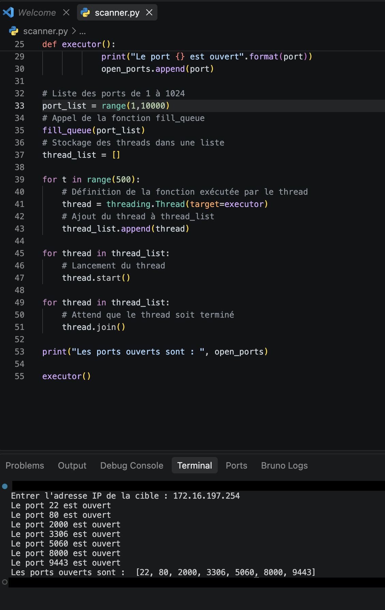

# scan-port

Le programme Python permet de scanner les ports d’une adresse IP afin d’identifier ceux qui sont ouverts. L’utilisateur commence par saisir l’adresse IP de la cible.

Le script utilise le module socket pour tenter une connexion TCP sur chaque port. Si la connexion réussit, le port est considéré comme ouvert et est ajouté à une liste.

Le programme analyse les ports 1 à 1023 et utilise une file d’attente ainsi que 500 threads pour effectuer plusieurs tests en parallèle et accélérer le scan.

À la fin de l’exécution, le programme affiche la liste complète des ports ouverts détectés sur la cible.

Conclusion : ce script constitue un scanner de ports simple permettant de découvrir les services potentiellement accessibles sur une machine grâce aux connexions TCP et au multithreading.

```python
import socket
import threading
from queue import Queue

# Demande à l'utilisateur
target = input("Entrer l'adresse IP de la cible : ")

# Création de la queue
queue = Queue()

# Liste des ports ouverts
open_ports = []

def port_scan(port):
    try:
        # Configuration de socket
        sock = socket.socket(socket.AF_INET, socket.SOCK_STREAM)
        # Connexion à la cible sur le port passé en paramètre
        sock.connect((target, port))
        return True
    except:
        return False

def fill_queue(port_list):
    for port in port_list:
        queue.put(port)

def executor():
    while not queue.empty():
        port = queue.get()
        if port_scan(port):
            print("Le port {} est ouvert".format(port))
            open_ports.append(port)

# Liste des ports de 1 à 1024
port_list = range(1, 1024)

# Appel de la fonction fill_queue
fill_queue(port_list)

# Stockage des threads dans une liste
thread_list = []

for t in range(500):
    # Définition de la fonction exécutée par le thread
    thread = threading.Thread(target=executor)
    # Ajout du thread à thread_list
    thread_list.append(thread)

for thread in thread_list:
    # Lancement du thread
    thread.start()

for thread in thread_list:
    # Attend que le thread soit terminé
    thread.join()

print("Les ports ouverts sont : ", open_ports)
```

<p align="center">
  
</p>
